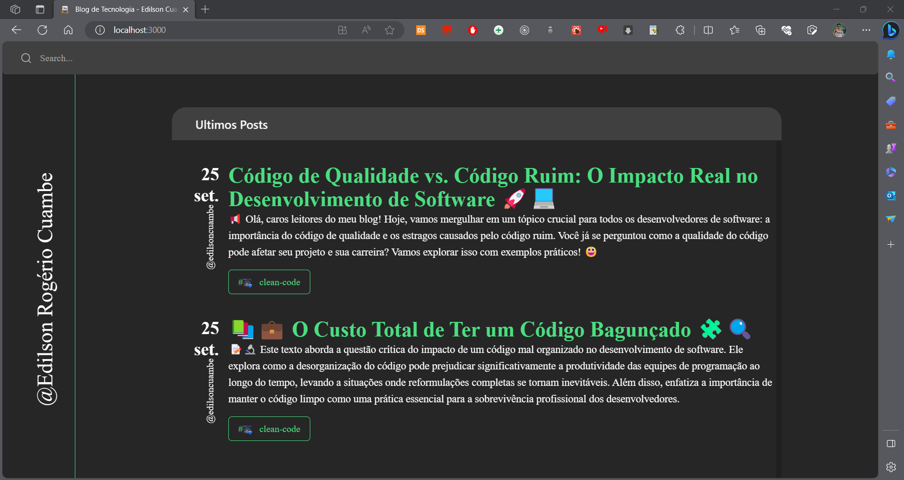
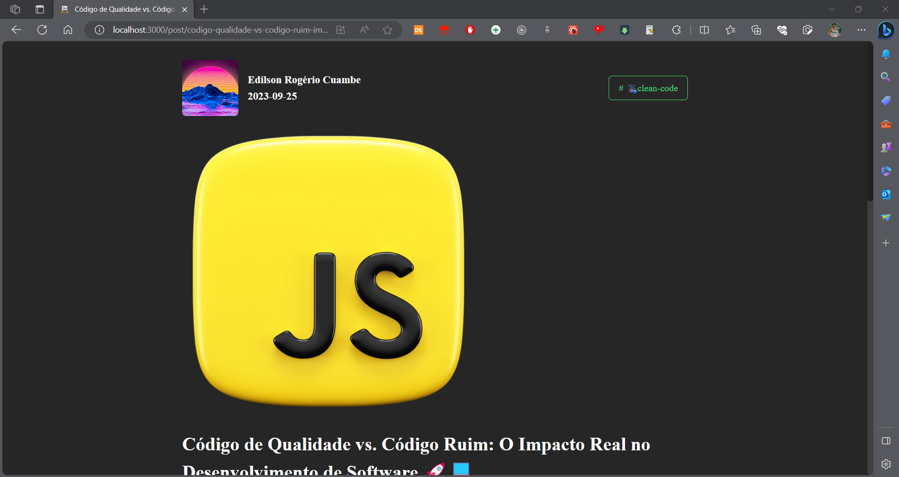
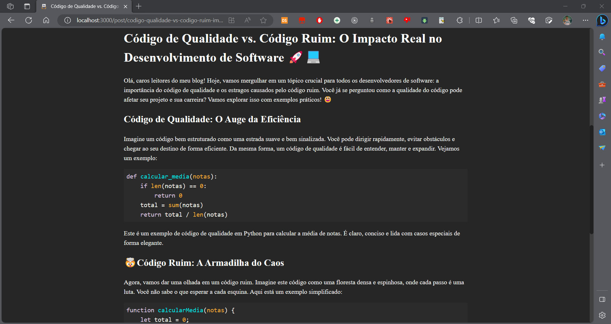

# Blog de Tecnplogia - (Edilson Cuambe)

### Imagens





## Instalação

Para instalar as dependências do projeto, execute o comando abaixo:

```bash
npm install
```

## Descrição

Este é um blog de tecnologia, onde eu Edilson Cuambe, irei postar artigos sobre tecnologia, principalmente sobre desenvolvimento de software.
